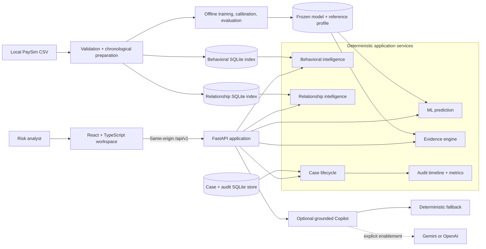

# Fraudetect AI

## Explainable Payment Fraud Risk & Investigation Workspace

[](pyproject.toml)
[](pyproject.toml)
[](frontend/package.json)
[](#testing--verification)
[](LICENSE)

> **ML detects risk. Deterministic intelligence explains the context. Humans retain control.**

Fraudetect AI turns a payment-risk score into a structured analyst investigation. It combines a
frozen calibrated model, deterministic evidence, causal behavioral and relationship context, an
optional grounded Copilot, controlled case resolution, and an append-only audit timeline.

This is a **PaySim-backed portfolio implementation** for the Razorpay AI Risk Manager problem. It
does not process Razorpay production data, block payments, or make autonomous fraud decisions.

[**🚀 Live Demo — Coming after deployment**](docs/deployment.md) ·
[**📚 Documentation**](#documentation) ·
[**🧪 Tests**](#testing--verification)

---

## Why Fraudetect AI?

A fraud score can rank risk, but it does not tell an analyst what evidence exists, whether the
activity differs from earlier behavior, what relationship history is available, or what decision
was ultimately made.

Fraudetect AI adds the operational layer around the model:

- **ML risk** provides a calibrated probability and risk band.
- **Deterministic evidence** explains factual score and reference context.
- **Behavioral intelligence** compares the event with earlier activity from the same origin.
- **Relationship intelligence** summarizes earlier pair and network context.
- **Case workflow** separates model output, workflow priority, and analyst disposition.
- **Optional Copilot** organizes only approved evidence into an advisory brief.
- **Auditability** preserves the original investigation snapshot and subsequent workflow events.

The system is designed to support an analyst—not replace one. No endpoint approves, blocks,
refunds, or otherwise acts on a real payment.

## Product Overview

**Fraud detection** answers: _How risky does the frozen model consider this transaction?_

**Fraud investigation and risk management** answer: _Why does the event deserve attention, what
earlier context exists, what remains uncertain, and how did a human analyst resolve the case?_

Fraudetect AI implements both layers in a single modular application. Core prediction and
investigation remain available even when no external LLM is configured.

## Core Capabilities

| Capability | Current implementation |
|---|---|
| **Calibrated ML risk scoring** | Frozen, class-weighted HistGradientBoosting pipeline returns probability, LOW/MEDIUM/HIGH risk, and a simulated policy recommendation. |
| **Deterministic evidence** | Stable evidence IDs cover model threshold, amount, balance, transaction type, time, and available historical context. |
| **Behavioral Intelligence** | Compares a referenced event with strictly earlier activity from the same internal PaySim origin. |
| **Relationship Intelligence** | Summarizes earlier origin-destination pair history and aggregate origin/destination network breadth. |
| **Investigation Summary** | Compact, frontend-generated summary derived only from the immutable case snapshot; explicitly not LLM-generated. |
| **Analyst case management** | Creates, lists, filters, retrieves, updates, and closes identifier-free investigation cases. |
| **Workflow priority** | Deterministic LOW/MEDIUM/HIGH/CRITICAL queue ordering that remains separate from ML risk. |
| **Analyst disposition** | Human-controlled NONE, CLEARED, or ESCALATED outcome; never treated as model ground truth. |
| **Audit timeline** | Server-generated case, Copilot, note, and lifecycle events with SQLite UPDATE/DELETE protection. |
| **Grounded Copilot** | Optional Gemini/OpenAI adapters produce typed advisory reports that must pass local validation and grounding checks. |
| **Deterministic fallback** | Reproducible, explicitly non-LLM brief for disabled, unavailable, timed-out, invalid, or rejected providers. |
| **Privacy boundaries** | Positive field selection excludes transaction references, account identifiers, raw histories, and individual fraud labels from stored cases and provider context. |
| **Showcase mode** | Isolated three-case demonstration built from genuine prepared PaySim rows and minimal causal history subsets. |

## End-to-End Investigation Flow

```text
Prepared transaction
        ↓
Safe feature extraction
        ↓
Calibrated ML probability and risk
        ↓
Deterministic evidence
        ↓
Causal behavioral intelligence
        ↓
Causal relationship intelligence
        ↓
Immutable case snapshot
        ↓
Deterministic Investigation Summary
        ↓
Optional grounded Copilot or deterministic fallback
        ↓
Human analyst review
        ↓
Escalate or clear → close
        ↓
Append-only audit timeline
```

1. A prepared reference is resolved internally, or the API receives the supported manual scoring
   fields.
2. The frozen pipeline derives two safe features and calculates fraud probability.
3. Evidence services add training-reference and available historical context without modifying the
   score.
4. A positive-selection sanitizer creates the identifier-free case snapshot.
5. The analyst reviews the snapshot, may request an advisory brief, adds a note, and controls the
   lifecycle decision.
6. Server-generated events preserve what happened after the original intelligence was captured.

## System Architecture



The application is a modular monolith: one FastAPI service with explicit internal boundaries and
one React client. SQLite and versioned model files keep the portfolio demonstration reproducible
without introducing deployment-heavy infrastructure.

## Dataset & ML

The current training and demonstration dataset is **PaySim**, a public simulator-generated
mobile-money dataset. It is synthetic and is **not Razorpay production data**.

| Prepared PaySim data | Count |
|---|---:|
| Transactions | 6,362,620 |
| Fraud transactions | 8,213 |
| Training rows | 4,463,587 |
| Validation rows | 943,289 |
| Held-out test rows | 955,744 |

The split uses complete chronological PaySim steps: training steps 1–323, validation steps
324–377, and held-out test steps 378–743. The test set is loaded only after model and threshold
selection are frozen.

### Scoring-time feature contract

The model accepts exactly six pre-decision features:

```text
transaction_type
amount
origin_balance_before
hour_of_day
log_amount
amount_to_origin_balance
```

Labels, identifiers, post-event balances, destination balance, absolute simulation step/day,
balance-error fields, and synthetic device/IP enrichment are excluded by construction.

### Selected model

- **Model:** class-weighted `HistGradientBoostingClassifier`
- **Calibration:** chronological sigmoid calibration
- **Operating mode:** validation-selected `BALANCED`
- **Default threshold:** `0.4002576812593272`
- **Selection rule:** highest validation BALANCED-policy F1, with PR-AUC and ROC-AUC only as
  tie-breakers

The serialized pipeline is frozen so analyst decisions, case updates, and Copilot output cannot
change its features, probability, calibration, or thresholds. Runtime performs inference only; it
does not retrain or learn from case dispositions.

### Held-out PaySim evaluation

| Metric | Result |
|---|---:|
| Precision | **95.38%** |
| Recall | **82.89%** |
| F1 | **88.70%** |
| PR-AUC | **0.971447** |
| ROC-AUC | **0.999845** |
| False positives | 161 |
| False negatives | 686 |

These are results from the synthetic PaySim chronological held-out period. They are not Razorpay
production metrics and should not be generalized to live merchant traffic. See
[`docs/evaluation.md`](docs/evaluation.md) for candidate comparisons, review-capacity results, and
temporal-drift context.

## Causal / Temporal Safety

> ### `historical.step < current.step`
>
> Behavioral and relationship intelligence can use only events from an earlier PaySim step.
> Same-step and future events are excluded from the current transaction's context.

Online SQLite queries include the strict step predicate. Offline generators evaluate all events in
a step before adding that step to historical state. Tests confirm that mutating same-step or future
events cannot change an earlier context.

This boundary prevents investigation-time history from silently becoming future leakage. Historical
aggregates are not part of the frozen six-feature ML model.

## Behavioral Intelligence

For a referenced PaySim transaction, the behavioral provider compares the event with earlier
transactions from the same internal origin and returns identifier-free aggregates:

- Previous transaction count and total amount
- Average, median, and maximum prior amount
- Current amount versus prior average, median, and maximum
- Empirical percentile within prior amounts
- Whether the current amount exceeds the prior maximum
- Activity in the previous 1, 6, and 24 PaySim steps
- Steps since the previous transaction
- Prior count for the current transaction type
- Whether that type is new in the available origin history

If no eligible earlier activity exists, the API returns zero counts, absent comparisons, and an
explicit availability explanation. It does not invent a baseline or describe the transaction as
suspicious merely because history is missing.

## Relationship Intelligence

The relationship provider calculates three factual views:

- **Direct pair:** earlier interactions between the same origin and destination
- **Origin network:** earlier transaction count and unique destinations for the origin
- **Destination network:** earlier transaction count and unique origins for the destination

Where pair history exists, the contract supports prior counts, amount statistics and ratios,
historical percentile, prior maximum comparison, time since the previous interaction, and a limited
baseline indicator.

The current prepared PaySim dataset contains **zero repeated exact origin-destination pairs**.
Genuine PaySim cases therefore report a first-observed direct pair, while origin or destination
network context may still be non-zero. The system does not fabricate repeated relationships,
shared identities, hidden connections, or device/IP risk.

## Investigation Workspace

The responsive analyst workspace presents:

- System readiness and aggregate workflow metrics
- A filterable investigation queue
- Clearly separated ML risk, workflow priority, status, and human disposition
- Fraud probability, active threshold, and simulated policy recommendation
- Deterministic evidence with severity and stable evidence IDs
- Behavioral and relationship context with honest unavailable states
- A deterministic at-a-glance Investigation Summary
- Optional Copilot output with visible real-provider/fallback provenance
- Analyst notes and server-enforced lifecycle actions
- An append-only chronological decision trace
- Recorded investigation limitations

The supported lifecycle is:

```text
OPEN → IN_REVIEW → ESCALATED → CLOSED
                 └→ CLEARED   → CLOSED
```

Invalid or repeated transitions are rejected. Closed cases cannot accept new notes, Copilot output,
or lifecycle changes. The analyst disposition is never fed back into the model as ground truth.

## Copilot / AI Safety

Gemini and OpenAI are optional server-side providers. The core fraud-risk engine, evidence,
historical intelligence, case workflow, and fallback require no API key.

The Copilot boundary provides:

- Explicit provider enablement; a credential alone cannot activate external generation
- A positive-selection `SanitizedInvestigationContext`
- No transaction reference, origin/destination identifier, or raw history in provider context
- Structured JSON output through the provider SDK
- Full local `InvestigationReport` validation
- Evidence-ID and factual grounding checks
- Rejection of invented identities, histories, percentages, fraud claims, and irreversible actions
- Bounded failure categories without raw provider diagnostics
- An explicitly labeled deterministic fallback for every controlled failure path

Copilot cannot modify probability, risk level, threshold, workflow priority, status, disposition, or
the frozen model. The human analyst remains authoritative.

The Gemini adapter and simulated provider paths are tested. A minimal live Gemini call confirmed
credential and model reachability, but a complete real-provider investigation report has **not yet
been produced successfully end to end**. Deterministic fallback is the verified default and is not
presented as LLM-generated output.

## Demo Showcase

The isolated showcase selects genuine prepared PaySim rows without consulting fraud labels and
copies only the causal history needed for three presentation scenarios.

| Scenario | What it demonstrates |
|---|---|
| **Strong Investigation** | HIGH ML risk, CRITICAL workflow priority, non-zero behavioral and origin/destination network context, deterministic evidence, saved fallback brief, analyst review, and audit events. |
| **Limited Context** | MEDIUM ML risk on an early PaySim event, no eligible history, explicit unavailable context, and no fabricated intelligence. |
| **Lower-Risk Resolution** | LOW ML risk with non-zero historical/network context, independent workflow priority, human clearance, and an audit timeline. |

Scenario selection and intelligence are reproducible. Normal application case IDs and timestamps are
generated when the showcase database is created. The scenario names and internal PaySim references
do not enter public case payloads.

## Normal vs Showcase Mode

| | Normal PaySim mode | Showcase mode |
|---|---|---|
| Purpose | Local development and full-index testing | Curated portfolio presentation |
| History | Full prepared PaySim indexes | Minimal isolated history subsets |
| Cases | Normal local case database | Isolated three-case database |
| Case creation | Any valid prepared PaySim reference | Primarily the three curated scenarios |
| Public deployment | Too large for the initial showcase | Intended first deployment mode |

### Local prerequisites

Python 3.11+ and Node.js 20+ are required. Install the tracked application and development
dependencies without adding any dataset or model artifact to Git:

```bash
python3.12 -m venv .venv
.venv/bin/python -m pip install -e ".[dev,ml]"
cp .env.example .env
cd frontend && npm install && cd ..
```

The raw PaySim CSV, prepared splits, model bundle, and SQLite indexes are intentionally not bundled
with a clone. Follow [`docs/data.md`](docs/data.md) to prepare them, or follow
[`docs/demo-guide.md`](docs/demo-guide.md) when the required local artifacts are already available.

Start normal mode:

```bash
make normal
```

Generate the showcase once, then start it:

```bash
make demo-cases
make demo
```

The generator refuses to overwrite an existing showcase unless replacement is explicitly forced.
Switching modes changes database configuration without replacing the normal case store.

### Local frontend

```bash
cd frontend
npm install
npm run dev
```

The Vite development server proxies `/api` to the local FastAPI service. Full setup and presentation
steps are documented in [`docs/demo-guide.md`](docs/demo-guide.md).

## Product Preview

No product screenshots are currently tracked in the repository, and this README intentionally uses
no fabricated mockups or stock imagery.

After the final public deployment, the most useful screenshots to add are:

1. Investigation dashboard and queue
2. Strong Investigation risk, evidence, and summary
3. Behavioral and Relationship Intelligence panels
4. Analyst workflow and audit timeline
5. Limited Context unavailable-history state
6. Real-provider/fallback Copilot provenance panel

## Security & Privacy

| Protection | Current behavior |
|---|---|
| Secrets | `.env` is ignored; keys are server-side and excluded from tracked configuration. |
| Dataset | Raw and processed PaySim data are ignored and absent from the deployment image. |
| Case privacy | Transaction references and internal origin/destination keys are not stored in case snapshots. |
| Historical privacy | Public responses return bounded aggregates, not raw behavioral or relationship rows. |
| Labels | Individual PaySim fraud labels are not stored in history indexes or exposed in public cases. |
| Provider boundary | Copilot receives allowlisted fields and safe aggregate evidence only. |
| Error handling | Validation and provider failures return sanitized messages and bounded categories. |
| Runtime artifacts | Private archive download requires HTTPS and configured SHA-256 verification. |
| Archive installation | HTTPS redirects are allowed without cross-origin bearer-token forwarding; HTTP redirects, unsafe paths, duplicates, directories, encryption, unsupported compression, unexpected files, and oversized archives are rejected. |
| Showcase cases | The seed initializes an isolated case store only when it is absent; Free Render may reset this ephemeral store when an instance is replaced. |
| Audit events | Server-generated events participate in the recorded operation; SQLite triggers reject UPDATE and DELETE. |

These are portfolio safeguards, not a substitute for production authentication, authorization,
tenancy, retention, encryption governance, or infrastructure security controls.

## Deployment

> **Deployment configuration is prepared, but the public deployment has not yet been completed.**

**🚀 Live Demo: Coming soon**

The prepared Render architecture uses:

- One FastAPI/Uvicorn web-service instance
- `0.0.0.0:$PORT` production binding without reload mode
- Compiled React frontend served by FastAPI on the same public origin
- `/api/v1/health` and safe component readiness endpoints
- Ephemeral `/tmp` storage for the writable showcase case store on Render Free
- A checksum-verified private runtime bundle containing the frozen model and small showcase indexes
- No raw PaySim CSV or full history indexes
- Deterministic Copilot fallback enabled by default; no Gemini key required

The runtime installer verifies HTTPS transport, archive SHA-256, size limits, member metadata, an
exact file allowlist, expected SQLite schemas, and the three-case seed before startup. Startup does
not overwrite an existing case store in the active instance. Render can reset that store after a
restart, spin-down, or redeploy, at which point it is initialized again from the curated seed. The
local normal mode continues to use the full prepared PaySim indexes and its separate ignored case
database.

See [`docs/deployment.md`](docs/deployment.md) for the Render Blueprint, private artifact workflow,
required configuration, and remaining deployment steps.

## Project Structure

```text
backend/
├── app/api/routes/          Versioned FastAPI endpoints
├── app/schemas/             Typed public contracts
├── app/services/            Risk, evidence, intelligence, case, audit, and Copilot services
└── app/deployment.py        Same-origin production application
frontend/
├── src/                     React/TypeScript analyst workspace
└── package.json             Frontend build configuration
ml/fraudetect_ml/
├── data/                    PaySim contracts, preparation, enrichment, and history indexes
└── modeling/                Candidates, calibration, thresholds, evaluation, and artifacts
scripts/                     Reproducible data, training, showcase, and runtime commands
tests/                       Regression, privacy, causality, lifecycle, provider, and deployment tests
docs/                        Technical design and operating documentation
Makefile                     Local normal/showcase workflows
pyproject.toml               Python package and development dependencies
requirements-deploy.txt      Pinned deployment runtime
render.yaml                  Render showcase Blueprint
```

Raw datasets, generated splits, serialized models, SQLite databases, runtime archives,
dependencies, and build output are intentionally not part of the tracked tree.

## Technology Stack

| Layer | Technologies |
|---|---|
| Frontend | React, TypeScript, Vite |
| Backend | Python, FastAPI, Pydantic, Uvicorn |
| ML | scikit-learn, HistGradientBoosting, sigmoid calibration, pandas, NumPy, joblib |
| Data & persistence | PaySim, SQLite |
| Optional AI | Google Gen AI Gemini, OpenAI Responses API, deterministic fallback |
| Testing | Pytest, Ruff, TypeScript compiler, Vite production build |
| Deployment | Render Blueprint, production Uvicorn, same-origin static frontend |

## Testing & Verification

Latest verified repository state:

| Check | Result |
|---|---|
| Full Python suite | **136 passed** |
| Deployment tests | **Passed** |
| Ruff | **Passed** |
| `git diff --check` | **Passed** |
| Frontend production build | **Passed** |
| Production startup | **Passed** |
| Health endpoint | **HTTP 200** |
| Showcase readiness | **All seven components ready** |
| Showcase queue | **Exactly three curated cases verified** |
| Frozen model SHA-256 | `9664e4f43e48dcf86f0dc4e2293092a55af97c92d9f9b0b3ff93cd885ac99e92` |

Tests cover temporal splitting, training-only preprocessing, frozen scoring behavior, evidence
determinism, causal history, identifier boundaries, Copilot grounding, safe provider failure,
execution provenance, case lifecycle, closure protection, snapshot immutability, append-only audit
events, legacy database compatibility, aggregate metrics, showcase isolation, and runtime archive
security.

There is currently no automated React component/browser-E2E suite, coverage percentage, load test,
or public-cloud verification. Provider tests use injected clients and do not make external requests.

Run the local checks with:

```bash
.venv/bin/pytest -q
.venv/bin/ruff check backend ml scripts tests
cd frontend && npm run build
```

## Why This Fits the Razorpay AI Risk Manager Problem

Fraudetect AI demonstrates the architecture around a risk decision: calibrated prediction,
explainable evidence, causal historical context, operational prioritization, human review, safe AI
assistance, and auditability.

```text
Current implementation
PaySim transaction → Fraudetect AI

Production adaptation
Razorpay transaction
→ Razorpay/provider-specific data adapter
→ reviewed feature and causal-history contract
→ separately trained and calibrated risk model
→ Fraudetect AI investigation workflow
```

No Razorpay production data, API integration, or Razorpay-specific adapter currently exists. A real
integration would require governed field mapping, production identity/history services, model
retraining and calibration, authentication, tenancy, monitoring, and payment-policy integration.

## Limitations & Roadmap

- PaySim is public synthetic data and cannot establish merchant production performance.
- There is no live Razorpay integration or production data adapter.
- Full live Gemini investigation generation is not yet proven end to end.
- SQLite and a single backend instance are suitable for the showcase, not distributed production.
- The first public deployment is designed for the isolated three-case showcase rather than the full
  PaySim history indexes.
- Production authentication, authorization, tenancy, data governance, monitoring, and streaming
  infrastructure remain outside the current portfolio scope.

The immediate next step is to publish the reviewed repository, supply the private runtime bundle to
Render, deploy the showcase, run public smoke/security checks, and replace the live-demo placeholder
with the verified URL.

## 30-Second Explanation

> “I built Fraudetect AI as a fraud investigation workspace, not just a classifier. A frozen,
> calibrated model scores PaySim transactions, then deterministic services add evidence and
> strictly earlier behavioral and relationship context. An analyst can freeze that intelligence
> into a case, request an optional grounded Copilot brief, add notes, resolve the case, and retain
> an append-only timeline. The LLM cannot change the risk score, the product works without an API
> key, and the human analyst always owns the final decision.”

## Documentation

| Guide | Purpose |
|---|---|
| [`docs/project-spec.md`](docs/project-spec.md) | Product scope, architecture, and explicit non-goals |
| [`docs/evaluation.md`](docs/evaluation.md) | Model candidates, thresholds, held-out metrics, and drift |
| [`docs/explainability.md`](docs/explainability.md) | Evidence methodology and reference-profile boundaries |
| [`docs/behavioral-intelligence.md`](docs/behavioral-intelligence.md) | Behavioral aggregates and causal lookup |
| [`docs/relationship-intelligence.md`](docs/relationship-intelligence.md) | Pair/network context and PaySim topology limits |
| [`docs/llm-copilot.md`](docs/llm-copilot.md) | Sanitization, structured output, grounding, and fallback |
| [`docs/analyst-workflow.md`](docs/analyst-workflow.md) | Case lifecycle, priority, disposition, and closure |
| [`docs/auditability.md`](docs/auditability.md) | Append-only events, ordering, migration, and metrics |
| [`docs/demo-guide.md`](docs/demo-guide.md) | Normal/showcase operation and presentation narrative |
| [`docs/deployment.md`](docs/deployment.md) | Render architecture and private runtime artifacts |
| [`docs/engineering-decisions.md`](docs/engineering-decisions.md) | Key implementation trade-offs |

## License

The project source is available under the [MIT License](LICENSE). PaySim remains governed by its own
source terms and is not redistributed in this repository.
