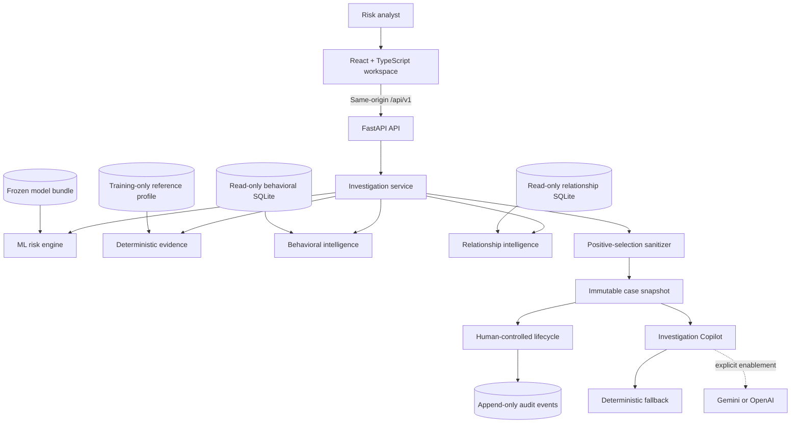
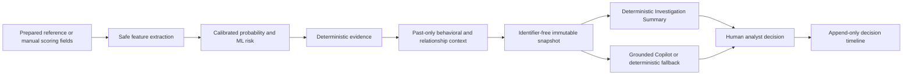
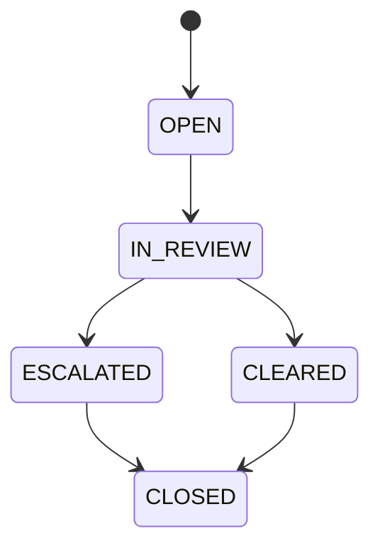
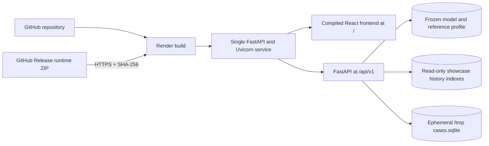

# Fraudetect AI — Explainable Fraud Investigation & Risk Intelligence

### Turn a payment-risk score into an evidence-backed, auditable analyst investigation.

[](pyproject.toml)
[](pyproject.toml)
[](frontend/package.json)
[](#testing--verification)
[](LICENSE)

> **ML detects risk. Deterministic intelligence explains the context. Humans retain control.**

Fraudetect AI is a payment-fraud risk and investigation workspace for risk analysts and technical
reviewers. A frozen, calibrated PaySim model produces a probability and ML risk band; deterministic
services then add evidence, strictly earlier behavioral context, relationship/network context,
case workflow, an optional grounded Copilot, and an append-only decision timeline.

It is a portfolio implementation for the Razorpay AI Risk Manager problem—not a Razorpay
integration, payment processor, or autonomous fraud-decision system.

**[Open the live showcase →](https://fraudetect-ai.onrender.com)** ·
**[Live API docs](https://fraudetect-ai.onrender.com/docs)** ·
**[Architecture](#architecture)** ·
**[Run locally](#run-locally)** ·
**[Documentation](#documentation-index)**

---

## 🚀 Live Demo

### **[Open Fraudetect AI →](https://fraudetect-ai.onrender.com)**

The public URL runs the deployed React workspace and FastAPI API from the same Render service. It is
seeded with **exactly three curated investigation cases** built from genuine prepared PaySim rows.
PaySim is synthetic, and the showcase is intentionally much smaller than the full local setup.

| Public-showcase boundary | What it means |
|---|---|
| **Three curated cases** | Demonstrates HIGH, MEDIUM, and LOW ML-risk scenarios without exposing the full dataset. |
| **Minimal causal history** | Includes only the small behavioral and relationship subsets required by those cases. |
| **No raw PaySim CSV** | Raw/prepared datasets and the full history indexes are not in the deployment image. |
| **Ephemeral case storage** | Free Render can reset analyst changes after a restart, spin-down, or redeploy. |
| **Unauthenticated shared demo** | It is a portfolio showcase; do not enter real payment or personal data. |
| **Deterministic Copilot fallback** | Gemini/OpenAI are disabled by default, so the public demo works without an API key. |

> A Free Render cold start may take a moment. The **full PaySim-backed environment**—6.36 million
> prepared rows, complete local indexes, and arbitrary valid prepared references—runs locally and
> is not exposed by the public website.

## 🎯 What can I try?

The deterministic showcase generator creates these three scenarios. Scenario names are documented
for evaluators but are not stored in public case payloads.

| Seeded scenario | How to recognize it | What it demonstrates |
|---|---|---|
| **Strong Investigation** | HIGH ML risk · CRITICAL priority · initially IN REVIEW | High model score, deterministic evidence, non-zero behavioral and origin/destination network context, saved fallback brief, analyst note, and audit events. |
| **Limited Context** | MEDIUM ML risk · HIGH priority · initially OPEN | A genuine early PaySim event with no eligible earlier-step history and explicit unavailable-context states. |
| **Lower-Risk Resolution** | LOW ML risk · HIGH priority · initially CLEARED | Low model risk alongside independent workflow priority, non-zero historical/network context, human clearance, and an audit trail. |

Suggested evaluator flow:

1. Compare ML risk, workflow priority, investigation status, and analyst disposition.
2. Open each case and inspect its deterministic Investigation Summary and evidence IDs.
3. Compare available history in Strong Investigation with the honest unavailable states in Limited Context.
4. Filter the queue by risk, priority, status, or disposition and reset the filters.
5. Review the deterministic Copilot provenance and append-only timeline.
6. Optionally exercise the analyst lifecycle; public state is shared and ephemeral.

## Public showcase vs full local mode

| | **Public Free Render showcase** | **Full local PaySim mode** |
|---|---|---|
| Purpose | Safe, lightweight portfolio presentation | Development, research, and full-index evaluation |
| Initial cases | Exactly three curated PaySim-derived cases | Normal local case database |
| Prepared dataset | Not deployed | 6,362,620 prepared PaySim rows |
| History | Minimal showcase-only SQLite subsets | Full behavioral and relationship indexes, about 1.66 GB |
| Case creation | Primarily the curated showcase workflow | Any valid prepared PaySim transaction reference |
| Storage | Ephemeral `/tmp` case database | Separate ignored local SQLite database |
| Persistence | Can reset when Render replaces the instance | Persists locally until explicitly replaced |
| External LLM | Disabled by default; deterministic fallback | Optional Gemini/OpenAI with explicit server-side enablement |
| Raw PaySim CSV | Not included | Supplied locally by the developer; never committed |

**The public demo is not the full PaySim application environment.** Both modes use the same
application contracts and frozen-model behavior, but only local mode loads the complete prepared
history indexes.

## Why this project is different

Many fraud demos end at `fraud_probability`. Fraudetect AI implements the investigation layer
around that score:

| Engineering decision | Why it matters |
|---|---|
| **Risk score plus evidence** | Analysts see stable evidence IDs and recorded facts instead of an unexplained number. |
| **Past-only intelligence** | Behavioral and relationship context enforce `historical.step < current.step`; same-step and future events cannot leak into an investigation. |
| **Separated semantics** | ML risk, workflow priority, case status, and human disposition remain distinct concepts. |
| **Frozen investigation snapshot** | Later notes, lifecycle actions, or Copilot output cannot change the original model result or captured intelligence. |
| **Append-only auditability** | Server-generated events record lifecycle, note, and Copilot actions; SQLite rejects audit UPDATE and DELETE. |
| **Safe optional AI** | Provider output must pass typed local validation and grounding; every controlled failure returns a labeled deterministic fallback. |
| **Honest deployment boundary** | The public service uses only the frozen model and small showcase subsets; full PaySim data remains local. |

For a focused technical review, continue through [Dataset & Model](#dataset--model),
[Causal intelligence](#causal-intelligence), [Analyst workflow](#analyst-workflow-and-copilot-safety),
[deployment](#public-deployment-architecture), and [testing](#testing--verification).

## Capability overview

| Area | Implemented capability |
|---|---|
| **ML risk detection** | Frozen class-weighted HistGradientBoosting pipeline returns calibrated probability, LOW/MEDIUM/HIGH risk, and a simulated policy recommendation. |
| **Explainable evidence** | Deterministic evidence covers the model threshold, amount, balance, transaction type, time, and available historical context. |
| **Behavioral intelligence** | Compares a referenced event with strictly earlier activity from the same internal PaySim origin. |
| **Relationship intelligence** | Summarizes earlier direct-pair context plus origin and destination network breadth. |
| **Investigation Summary** | Frontend-generated, deterministic at-a-glance summary derived only from the immutable case snapshot. |
| **Investigation workspace** | Responsive dashboard with readiness, workflow metrics, queue filters, evidence, intelligence, Copilot, and timeline views. |
| **Case management** | Creates, lists, filters, retrieves, updates, resolves, and closes identifier-free investigation cases. |
| **Lifecycle tracking** | Enforces `OPEN → IN_REVIEW → ESCALATED/CLEARED → CLOSED` server-side. |
| **Audit trail** | Chronological server-generated events with deterministic ordering and database immutability triggers. |
| **Copilot** | Optional Gemini/OpenAI structured reports with local validation, evidence grounding, provenance, and deterministic fallback. |
| **Privacy/security** | Positive-selection case/provider context excludes transaction references, raw identities, raw histories, and individual labels. |
| **Deployment** | Same-origin React + FastAPI service on Free Render with a checksum-verified runtime archive. |

## Architecture

Fraudetect AI is a modular monolith: one FastAPI application with explicit service boundaries and
one React/TypeScript client. SQLite and versioned artifacts keep the portfolio deployment compact
without introducing microservices or a distributed database.



### End-to-end investigation flow



## Dataset & Model

### What is PaySim?

[PaySim](docs/data.md) is a public simulator-generated mobile-money transaction dataset informed by
aggregated transaction patterns. Its rows include simulated time, transaction type, amount,
origin/destination account identifiers, balances, and supervised fraud labels. It is synthetic—not
Razorpay or merchant production data—and the raw CSV is not redistributed by this repository.

The model learns a narrow, scoring-time risk function. Fraudetect AI then adds a separate
investigation layer around the result; behavioral context, relationship context, analyst decisions,
and Copilot output do **not** feed back into the frozen score.

### Chronological evaluation design

Complete PaySim steps are kept together, preventing one simulated time step from appearing in more
than one split.

| Split | Complete steps | Rows | Fraud rows | Fraud prevalence | Purpose |
|---|---:|---:|---:|---:|---|
| Training | 1–323 | 4,463,587 | 3,643 | 0.081616% | Model fitting and later chronological calibration |
| Validation | 324–377 | 943,289 | 560 | 0.059367% | Candidate and threshold selection |
| Held-out test | 378–743 | 955,744 | 4,010 | 0.419568% | One-shot final evaluation only |
| **Total** | **1–743** | **6,362,620** | **8,213** | **0.129082%** | Prepared PaySim dataset |

Within training, steps 1–298 fit the candidates and later steps 299–323 fit sigmoid calibration.
Preprocessing and class weights use training data only. The held-out test file is loaded only after
the model and operating threshold are frozen.

### Six-feature scoring contract

| Submitted at scoring time | Derived by the backend |
|---|---|
| `transaction_type` | `log_amount` |
| `amount` | `amount_to_origin_balance` |
| `origin_balance_before` | |
| `hour_of_day` | |

The target, rule flag, transaction/account identifiers, post-event balances, destination balances,
absolute step/day, balance-error fields, and synthetic device/IP enrichment are explicitly excluded.

### Selected model

- **Candidate:** class-weighted `HistGradientBoostingClassifier`
- **Calibration:** chronological sigmoid calibration
- **Operating mode:** validation-selected `BALANCED`
- **Frozen threshold:** `0.4002576812593272`
- **Selection rule:** highest validation BALANCED-policy F1; PR-AUC and ROC-AUC are tie-breakers

### Held-out PaySim results

| Metric | Result |
|---|---:|
| Precision | **95.38%** |
| Recall | **82.89%** |
| F1 | **88.70%** |
| PR-AUC | **0.971447** |
| ROC-AUC | **0.999845** |
| True positives | 3,324 |
| False positives | 161 |
| False negatives | 686 |
| True negatives | 951,573 |
| Review rate | 0.364637% |

Confusion matrix at the frozen BALANCED threshold:

| | Predicted non-fraud | Predicted fraud |
|---|---:|---:|
| **Actual non-fraud** | 951,573 | 161 |
| **Actual fraud** | 686 | 3,324 |

These are synthetic PaySim results, not production Razorpay or merchant metrics. Temporal drift is
visible—the held-out fraud prevalence is higher than training and validation—and is intentionally
not normalized away. Candidate comparisons and capacity metrics are documented in
[`docs/evaluation.md`](docs/evaluation.md).

## Causal intelligence

> ### `historical.step < current.step`
>
> Only events from an earlier PaySim step are eligible. Same-step and future transactions are
> unavailable to the current investigation.

### Behavioral intelligence

For a prepared reference, the behavioral provider uses the same internal origin to calculate
identifier-free aggregates such as prior count and amount, average/median/maximum, current amount
ratios and percentile, recent 1/6/24-step activity, time since previous activity, and whether the
transaction type is new in the eligible history.

### Relationship intelligence

The relationship provider separates:

- **Direct pair:** earlier interactions between the same origin and destination
- **Origin network:** earlier transaction count and unique destinations for the origin
- **Destination network:** earlier transaction count and unique origins for the destination

The prepared PaySim index contains no eligible repeated exact origin-destination pairs. Public
cases therefore present first-observed direct pairs while still showing genuine non-zero network
context where available. The implementation does not fabricate shared identities or relationships.

Historical aggregates explain investigation context; they are not part of the frozen six-feature
ML model.

## Analyst workflow and Copilot safety

### Separate concepts, separate authority

| Concept | Controlled by | Meaning |
|---|---|---|
| **ML risk** | Frozen model and validation-selected thresholds | LOW, MEDIUM, or HIGH model assessment |
| **Workflow priority** | Deterministic case policy | LOW, MEDIUM, HIGH, or CRITICAL queue ordering—not another risk band |
| **Case status** | Server-enforced lifecycle | Current workflow stage |
| **Analyst disposition** | Human analyst | NONE, CLEARED, or ESCALATED; never model ground truth |



Closed cases reject notes, Copilot regeneration, and lifecycle mutations. Analyst updates cannot
change fraud probability, ML risk, operating mode, threshold, model version, or the frozen snapshot.

### Optional grounded Copilot

The core product requires no LLM. When a provider is explicitly enabled, Copilot receives only an
allowlisted `SanitizedInvestigationContext`, requests structured output, validates it against the
canonical local report model, and checks evidence grounding before returning it.

Every timeout, configuration failure, provider error, malformed response, or grounding rejection
returns the existing explicitly labeled deterministic fallback. Copilot remains advisory and
cannot change case state or model output. The public Render showcase uses fallback mode by default.

## Public deployment architecture



The deployment binds to `0.0.0.0:$PORT`, uses one backend instance, and serves frontend and API from
the same origin. The runtime archive is outside Git history and is verified for HTTPS transport,
SHA-256, size, exact members, safe metadata, paths, file types, and expected SQLite schemas before
startup. The deployed bundle excludes the raw PaySim CSV and the full 1.66 GB indexes.

See [`docs/deployment.md`](docs/deployment.md) for the Render Blueprint and rebuild process.

## API surface

Interactive documentation is available in the deployed
**[Swagger UI](https://fraudetect-ai.onrender.com/docs)**.

| Area | Endpoints |
|---|---|
| Health/readiness | `GET /api/v1/health`, `GET /api/v1/system/readiness` |
| Dataset/model | `GET /api/v1/dataset/status`, `GET /api/v1/model/status`, `GET /api/v1/model/evaluation` |
| Risk investigation | `POST /api/v1/risk/predict`, `POST /api/v1/risk/investigate`, `POST /api/v1/risk/investigate/copilot` |
| Cases | `POST /api/v1/cases`, `GET /api/v1/cases`, `GET /api/v1/cases/{case_id}`, `PATCH /api/v1/cases/{case_id}` |
| Case Copilot | `POST /api/v1/cases/{case_id}/copilot` |
| Operations | `GET /api/v1/system/metrics` |

No endpoint approves, blocks, refunds, or otherwise acts on a real payment.

## Run locally

### Prerequisites

- Python 3.11+; Python 3.12 matches the deployment environment
- Node.js 20+
- A locally obtained PaySim CSV for full mode

```bash
git clone https://github.com/adilbagwan46/fraudetect-Ai.git
cd fraudetect-Ai

python3.12 -m venv .venv
.venv/bin/python -m pip install -e ".[dev,ml]"
cp .env.example .env

cd frontend
npm install
cd ..
```

`.env`, PaySim data, generated indexes, model artifacts, SQLite databases, dependencies, and build
output are ignored. Do not put credentials or datasets in Git.

### Full PaySim mode

Place the source CSV at `data/raw/paysim.csv`, then prepare data, train the candidate models, build
the training-only evidence profile, and create the full indexes:

```bash
make prepare-data
make train-models
make reference-profile
make behavior-history
make relationship-history
make normal
```

Start the local frontend in another terminal:

```bash
make frontend-dev
```

Open `http://127.0.0.1:5173/`. See [`docs/data.md`](docs/data.md) for provenance and
[`docs/evaluation.md`](docs/evaluation.md) for the model-selection discipline.

### Local three-case showcase

After the full prepared indexes and frozen model are available:

```bash
make demo-cases
make demo
```

The showcase generator refuses to overwrite existing demo databases unless `--force` is explicitly
used. `make normal` and `make demo` select separate case/history databases, so switching modes does
not replace the normal local case store. See [`docs/demo-guide.md`](docs/demo-guide.md).

## Project structure

```text
backend/
├── app/api/routes/          Versioned FastAPI endpoints
├── app/schemas/             Typed public request/response contracts
├── app/services/            Risk, evidence, intelligence, cases, audit, and Copilot
└── app/deployment.py        Same-origin production application
frontend/
├── src/                     React/TypeScript analyst workspace
└── package.json             Frontend build configuration
ml/fraudetect_ml/
├── data/                    PaySim contracts, preparation, features, and history indexes
└── modeling/                Candidates, calibration, thresholds, evaluation, and artifacts
scripts/                     Data, training, showcase, and deployment-runtime commands
tests/                       ML, API, privacy, causality, workflow, AI, and deployment tests
docs/                        Product, data, evaluation, intelligence, workflow, and operations guides
Makefile                     Normal/showcase workflows and common commands
render.yaml                  Free Render showcase Blueprint
requirements-deploy.txt      Pinned deployment runtime
```

## Technology stack

| Layer | Technologies |
|---|---|
| Frontend | React, TypeScript, Vite |
| Backend | Python, FastAPI, Pydantic, Uvicorn |
| ML | scikit-learn, HistGradientBoosting, sigmoid calibration, pandas, NumPy, joblib |
| Data/persistence | PaySim, SQLite |
| Optional AI | Google Gen AI Gemini, OpenAI Responses API, deterministic fallback |
| Testing | Pytest, Ruff, TypeScript compiler, Vite production build |
| Deployment | Render Blueprint, same-origin FastAPI/React, verified runtime ZIP |

## Testing & verification

Latest verified repository state:

| Check | Result |
|---|---|
| Full Python suite | **140 passed** |
| Deployment security tests | **14 passed** |
| Ruff | **Passed** |
| `git diff --check` | **Passed** |
| Frontend production build | **Passed** |
| Production startup and health | **Passed** |
| Public showcase | **Online; readiness healthy; three seeded cases verified** |
| Frozen model SHA-256 | `9664e4f43e48dcf86f0dc4e2293092a55af97c92d9f9b0b3ff93cd885ac99e92` |

The suite covers temporal splits, training-only preprocessing, frozen prediction behavior,
deterministic evidence, causal history, identifier boundaries, Copilot validation/grounding,
provider failure handling, case lifecycle, closed-case protection, snapshot immutability,
append-only audit events, legacy database compatibility, operational metrics, showcase isolation,
and runtime-archive security.

```bash
.venv/bin/pytest -q
.venv/bin/ruff check backend ml scripts tests
npm --prefix frontend run build
```

There is no committed React component/browser-E2E suite, load test, or long-running production
monitoring. Provider tests use injected clients and do not make external API requests.

## Security, privacy, and limitations

### Implemented safeguards

- `.env`, datasets, model artifacts, SQLite files, runtime archives, dependencies, and build output
  are excluded from Git.
- Public case and Copilot contexts omit transaction references, internal account keys, raw history,
  individual fraud labels, credentials, and filesystem paths.
- Validation/provider failures return sanitized messages and bounded categories.
- History indexes are opened read-only; the public case store is separately writable and ephemeral.
- Runtime downloads require HTTPS and SHA-256 verification. HTTP redirects, unsafe archive paths,
  duplicates, encryption, unsupported file types/compression, unexpected members, and oversized
  archives are rejected. Bearer tokens are not forwarded across redirect origins.

### Current limitations

- PaySim is synthetic and cannot establish production merchant performance.
- The public demo starts with only three curated cases and does not expose the full PaySim indexes.
- The public demo is unauthenticated, shared, and ephemeral; it must not receive real payment data.
- There is no Razorpay production-data adapter or payment-action integration.
- SQLite and one backend instance are appropriate for this showcase, not distributed production.
- Full real-provider Gemini investigation generation is not yet proven end to end; deterministic
  fallback is the verified default.
- Production authentication, authorization, tenancy, governance, monitoring, and streaming remain
  outside the portfolio scope.

## Documentation index

| Guide | What it covers |
|---|---|
| [Project specification](docs/project-spec.md) | Product scope, architecture, API surface, and explicit non-goals |
| [Data card](docs/data.md) | PaySim provenance, field contract, enrichment boundaries, and split policy |
| [Model evaluation](docs/evaluation.md) | Candidate comparison, thresholds, held-out metrics, review capacity, and drift |
| [Explainability](docs/explainability.md) | Deterministic evidence methodology and training-reference boundaries |
| [Behavioral intelligence](docs/behavioral-intelligence.md) | Past-only origin behavior aggregates and lookup contract |
| [Relationship intelligence](docs/relationship-intelligence.md) | Direct pair and network context plus PaySim topology limits |
| [LLM Copilot](docs/llm-copilot.md) | Sanitization, provider adapters, validation, grounding, and fallback |
| [Analyst workflow](docs/analyst-workflow.md) | Case priority, lifecycle, disposition, notes, closure, and privacy |
| [Auditability](docs/auditability.md) | Append-only events, ordering, migrations, and operational metrics |
| [Demo guide](docs/demo-guide.md) | Deterministic scenario generation and presentation narrative |
| [Deployment guide](docs/deployment.md) | Render architecture, runtime artifact verification, and recovery |
| [Engineering decisions](docs/engineering-decisions.md) | Important trade-offs and rejected alternatives |
| [Implementation plan](docs/implementation-plan.md) | Completed phased delivery and technical decisions |
| [Live Swagger API](https://fraudetect-ai.onrender.com/docs) | Interactive documentation for the deployed API |

## License

The project source is available under the [MIT License](LICENSE). PaySim remains governed by its own
source terms and is not redistributed in this repository.
